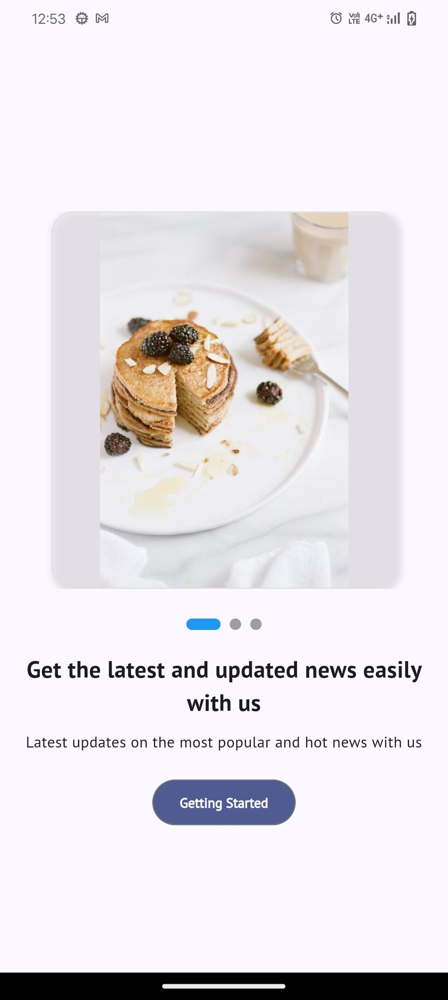
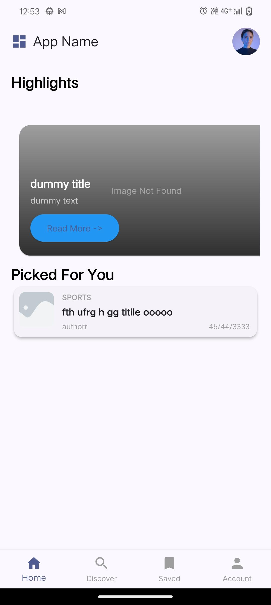
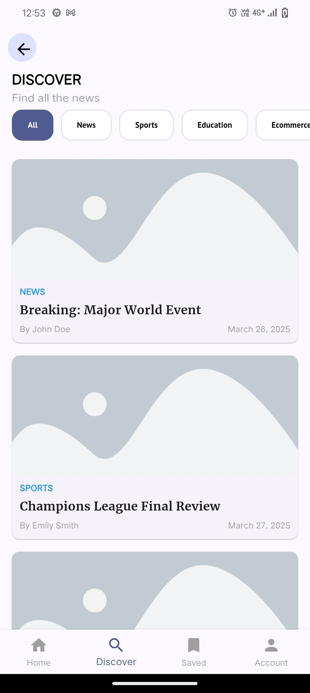
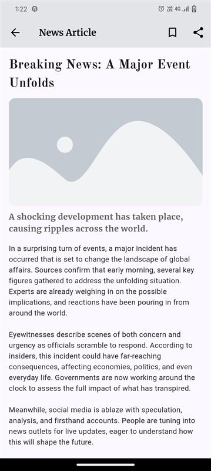
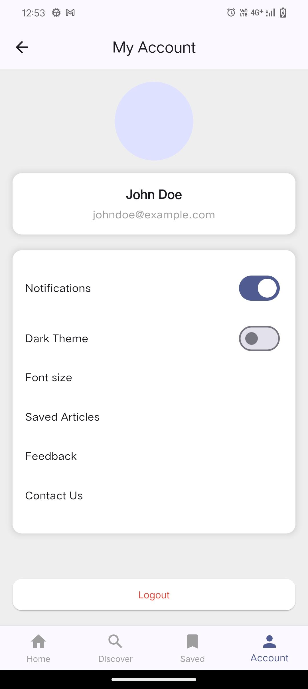

# **NewsApp**

## **Overview**
NewsApp is a modern and user-friendly mobile application designed to deliver an immersive news-reading experience. This project focuses solely on the design and UI/UX aspects, ensuring a clean and engaging interface for users.

- **Elegant UI Design**: A sleek and intuitive user interface with smooth navigation.
- **Category Filtering**: Users can browse news articles by categories such as Sports, Technology, Health, Entertainment, and more.
- **Dark & Light Mode**: Support for both light and dark themes to enhance readability.
- **Responsive Layout**: Optimized for various screen sizes to ensure a seamless experience across different devices.
- **Typography & Styling**: Carefully selected fonts and color schemes to give a newspaper-like reading experience.
- **News Detail Screen**: Includes a detailed news view with headlines, images, and structured content presentation.
- **Save & Share Options**: Users can bookmark articles for later reading and share news through different platforms.

## **UI Screens**
### **Landing page**
Auto scrolls images.



### **Home Screen**
Displays the latest news articles with category tabs.



### **Category Selection**
Filter news by different topics.



### **News Detail Screen**
Shows the full article with images and related information.



### **Profile & Settings**
Manage preferences such as theme selection.




## **Features**
- **Category Filtering**
- **Dark & Light Mode**
- **Save & Share Options**

## **Installation**

1. Clone the repository:
   ```bash
   git clone https://github.com/yourusername/newsapp.git
